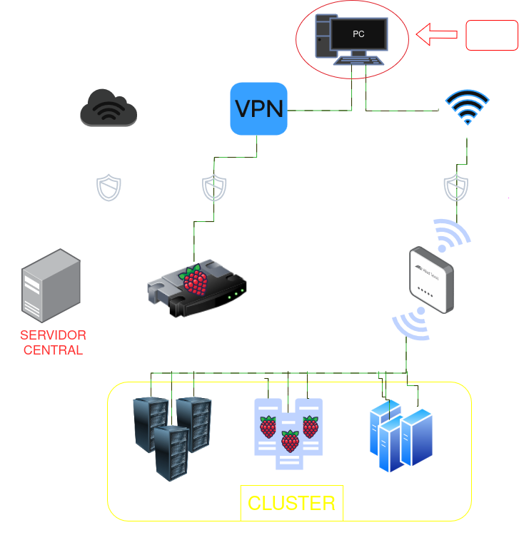

# Ansible-H.IAAC

Este repositório contém um conjunto de playbooks e configurações para provisionar e gerenciar um testbed para experimentos de Aprendizagem Federada. O ambiente é composto por um cluster **heterogêneo** de mini-computadores (Raspberry Pi e NVIDIA Jetson), orquestrado via Ansible e operando em uma sub-rede isolada.

O objetivo principal é criar uma plataforma que simula **cenários de borda (_edge computing_) do mundo real**, permitindo avaliar o desempenho de diferentes algoritmos em dispositivos com diversas restrições de hardware (capacidade de processamento, consumo de energia, dissipação térmica, etc.). A automação com Ansible garante que os experimentos sejam **reproduzíveis, escaláveis e fáceis de gerenciar**, acelerando o ciclo de pesquisa e eliminando configurações manuais repetitivas.

### 🏗️ Arquitetura do Ambiente

  

###🕹️ Guia de Operação no Servidor Central

Após conectar-se ao Servidor Central via SSH, utilize este guia para interagir com o ambiente do testbed.

Diretórios Principais

A operação do testbed está dividida em dois diretórios principais na home do usuário (~/):
Diretório	Propósito
~/TESTBED/	Diretório de Operações. Contém scripts de execução, configurações locais e o arquivo de senha do Ansible Vault.
~/Ansible-H.IAAC/	Diretório do Repositório. Contém o clone do projeto Git com todos os playbooks, roles e a automação.

Executando Playbooks Ansible

Para provisionar ou gerenciar os nós do cluster, siga os passos abaixo. O pré-requisito é que a execução deve ser sempre feita a partir da raiz do diretório do repositório.

    Navegue até o diretório do repositório:
    Bash

cd ~/Ansible-H.IAAC

Execute o playbook desejado: Utilize a estrutura de comando a seguir, substituindo o caminho para o playbook alvo.
Bash

    ansible-playbook -i inventory [caminho/para/o/playbook.yml] --vault-password-file ~/TESTBED/.ansible_vault_pass

Iniciando o Servidor de Aprendizagem Federada

Para iniciar um experimento de treino, o script do servidor central precisa ser executado.

    Navegue para o diretório de operações:
    Bash

cd ~/TESTBED

Ative o ambiente virtual (venv) do Python:
Bash

source venv/bin/activate

Execute o script do servidor:
Bash

    python server.py

Rodando o Servidor em Segundo Plano (Recomendado)

Para garantir que o processo do servidor (server.py) continue em execução mesmo após a sessão SSH ser encerrada, utilize um multiplexador de terminal como o screen.

    Crie uma nova sessão nomeada:
    Bash

screen -S federated_server

Inicie o servidor: Dentro da nova sessão, execute os comandos normalmente.
Bash

cd ~/TESTBED
source venv/bin/activate
python server.py

Desconecte da sessão: Para sair da sessão e deixá-la rodando em segundo plano, utilize o atalho: Ctrl + A, seguido de D.

Reconecte à sessão: Para retornar a uma sessão ativa, utilize o comando:
Bash

screen -r federated_server
